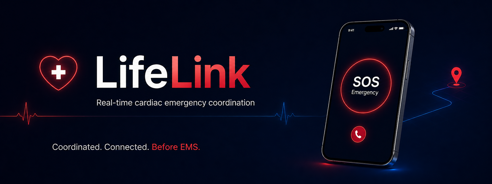
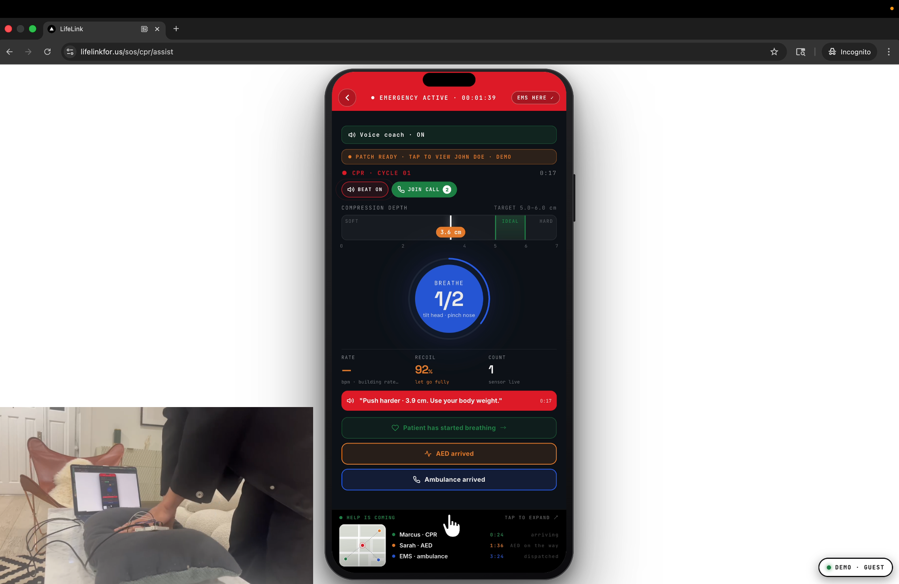
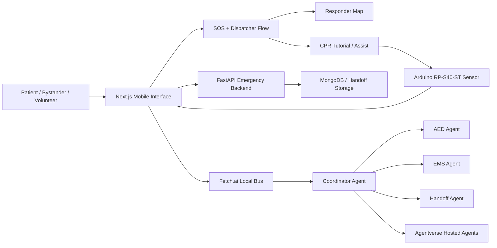
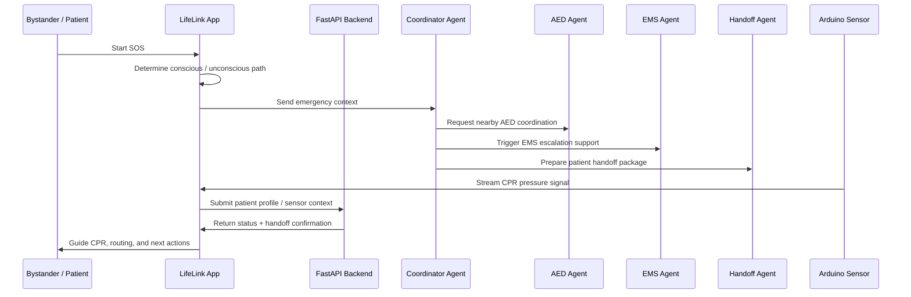

<div align="center">

<!-- Replace this banner with your own image. Recommended size: 1600x600. -->


<br />

# 🚑 LifeLink

### A real-time cardiac emergency response layer that coordinates people, AEDs, CPR guidance, patient handoff, and autonomous agents before EMS arrives.

<br />

[](https://nextjs.org/)
[](https://www.typescriptlang.org/)
[](https://fastapi.tiangolo.com/)
[](https://fetch.ai/)
[](https://www.arduino.cc/)

<br />

**Live Demo:** [lifelinkfor.us](https://lifelinkfor.us)  
**Built for:** emergency response, CPR assistance, AED routing, patient-profile handoff, and multi-agent coordination.

</div>

---

## 🎥 Demo

<div align="center">

[](docs/assets/video.mp4)

<br />

**Click the image above to watch the demo.**

</div>

---

## 🫀 Why LifeLink?

When someone collapses from sudden cardiac arrest, the hardest problem is not only medical — it is coordination.

People nearby may not know:

- where the closest AED is,
- who should start CPR,
- whether someone else already called emergency services,
- how to transfer patient information to responders,
- or how to keep acting during the critical minutes before EMS arrives.

**LifeLink closes that gap.** It acts as the missing response layer between the moment of collapse and professional medical arrival.

Instead of replacing 911 or EMS, LifeLink helps bystanders, volunteers, hardware signals, and autonomous agents work together in real time.

---

## ✨ What LifeLink Does

| Capability | Description |
|---|---|
| 🆘 Emergency activation | Patient, guest, or volunteer can start an SOS flow from the mobile-style interface. |
| 🧭 Dispatcher guidance | The app guides the responder through conscious / unconscious emergency paths. |
| 🗺️ AED + responder routing | Nearby helpers and AED pickup tasks can be coordinated through map-based flows. |
| 🫁 CPR tutorial + assist | CPR guidance is available through tutorial and assist screens, with optional voice support. |
| 📟 Arduino pressure sensor | RP-S40-ST pressure sensor flow can provide CPR compression feedback. |
| 🧬 Patient profile handoff | Patient details can be passed to the backend for emergency responder context. |
| 🤖 Agentverse orchestration | Fetch.ai / Agentverse agents coordinate AED search, EMS escalation, and patient handoff. |
| 🧪 Developer dashboard | Service health and telemetry can be viewed from a dedicated dashboard. |

---

## 🧠 System Overview

LifeLink is structured as a multi-runtime emergency coordination system:



---

## 🤖 Agentverse Agents

LifeLink includes a four-agent emergency coordination system deployed through Agentverse.

| Agent | Responsibility | Link |
|---|---|---|
| 🧭 **Coordinator Agent** | Central decision-maker that receives emergency context and routes work to specialist agents. | [Open Agent](https://agentverse.ai/agents/details/agent1qf39hy5w480wqetwekxy7z0hf8gkchdddf863thqhxsxsdynvqr9upx5q4f/profile) |
| 🧰 **Locate & Route Optimizer** | Searches for AED availability, pickup routing, and responder task assignment. | [Open Agent](https://agentverse.ai/agents/details/agent1qfedfdfe9l0cwejgrz30my4gmtjj8xjsam39hjzesa0khlhnsnmfg57k3p0/profile) |
| 🚑 **EMS + AED Agent** | Handles escalation logic and emergency-service coordination signals. | [Open Agent](https://agentverse.ai/agents/details/agent1qw3239g4tahjmw93fwqqp24hyhelljh70ee6wh59euqgrts0kdqfv8gtdll/profile) |
| 📋 **Hospital Handoff Agent** | Packages structured patient context for responder handoff. | [Open Agent](https://agentverse.ai/agents/details/agent1q2z070qakeu20musu62dcegcdykse3kx403tugtc4u09fwgu72gwsg8nc29/profile) |

---

## 🧩 Core User Flow



---

## 🛠️ Tech Stack

| Layer | Technologies |
|---|---|
| Frontend | Next.js 14, React, TypeScript, Tailwind CSS |
| UI / Components | shadcn-style components, Lucide icons, mobile-first interaction design |
| Maps / Routing | Mapbox, Leaflet, Deck.gl, Turf |
| Backend | FastAPI, Python |
| Agent System | Fetch.ai, Agentverse, uAgents-style local bus |
| Hardware | Arduino Nano Every, RP-S40-ST thin-film pressure sensor |
| Data / Storage | MongoDB, Supabase migration support |
| Voice / Guidance | ElevenLabs TTS support |
| Deployment | Vercel frontend, optional local backend and agent runtimes |

---

## 📁 Project Structure

```txt
LifeLink/
├── app/                         # Next.js App Router pages and API routes
├── components/
│   ├── lifelink/                # Main LifeLink mobile UI components
│   └── ui/                      # Shared UI primitives
├── lib/                         # Hooks, CPR logic, voice helpers, Mongo client, scenarios
├── backend/                     # FastAPI emergency backend
├── bus/                         # Local Fetch.ai/uAgents event bus and specialist agents
├── agentverse-deploy/           # Hosted Agentverse deployment files
├── arduino/pressure_sensor_rps40st/
│                                  # RP-S40-ST CPR pressure sensor sketch
├── public/cpr/                  # CPR guide assets
├── scripts/                     # Seed, test, and data scripts
├── supabase/migrations/         # Database migration files
├── docs/                        # Reports, notes, and additional documentation
└── archive/                     # Legacy orchestration code kept for reference
```

---

## 🚀 Quick Start

### 1. Clone the repository

```bash
git clone https://github.com/FionaZOZ/LifeLink.git
cd LifeLink
```

### 2. Install frontend dependencies

```bash
npm install
```

### 3. Configure environment variables

```bash
cp .env.local.example .env.local
```

Fill only the services you want to demo.

```env
NEXT_PUBLIC_MAPBOX_TOKEN=your_mapbox_token
MONGODB_URI=your_mongodb_uri
ELEVENLABS_API_KEY=your_elevenlabs_key
ELEVENLABS_VOICE_ID=your_elevenlabs_voice_id

NEXT_PUBLIC_CARDIACLINK_API_URL=http://localhost:8000
BUS_EVENT_URL=http://localhost:8010
NEXT_PUBLIC_BUS_EVENT_URL=http://localhost:8010

AGENTVERSE_BASE_URL=https://agentverse.ai
AGENTVERSE_API_KEY=your_agentverse_api_key
```

### 4. Run the frontend

```bash
npm run dev
```

Open:

```txt
http://localhost:3000
```

---

## 🧭 Main Routes

| Route | Purpose |
|---|---|
| `/` | Patient / guest / volunteer home |
| `/profile` | Role and patient profile setup |
| `/sos` | Emergency start flow |
| `/sos/dispatch/conscious` | Dispatcher flow for conscious patient |
| `/sos/dispatch/unconscious` | Dispatcher flow for unconscious patient |
| `/sos/map` | Live responder map |
| `/sos/cpr/tutorial` | CPR tutorial |
| `/sos/cpr/assist` | CPR assist with sensor and voice support |
| `/patient/hardware` | Apple Watch / Arduino hardware setup |
| `/dev/dashboard` | Service health and developer dashboard |

---

## 🧱 Architecture Highlights

### 1. Mobile-first emergency interface

The active app is built as a mobile-style emergency interface optimized for fast, high-stress interactions. The flow prioritizes clear actions, simple branching, and immediate visual feedback.

### 2. Multi-agent task orchestration

LifeLink separates emergency coordination into specialist agents: one central coordinator, one AED agent, one EMS agent, and one handoff agent. This makes the system easier to extend and reason about.

### 3. CPR feedback bridge

The Arduino flow connects physical compression signals into the web app, allowing CPR assistance to react to sensor input instead of only static instructions.

### 4. Patient-profile handoff

Emergency context can be passed through the backend so responders have access to relevant patient details instead of receiving only a generic SOS signal.


---


<div align="center">

### LifeLink

**Every second counts. Coordinate faster. Respond smarter. Keep people alive until help arrives.**

</div>
